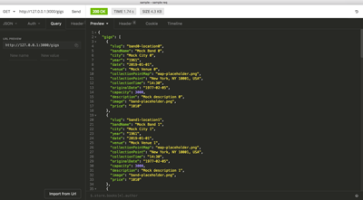
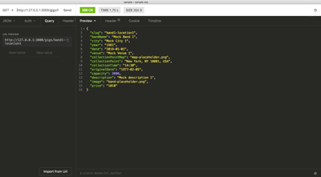

# Ticketless — getting started with Serverless and Lambda functions

| Previous lesson  | Next lesson      |
| :--------------- | ---------------: |
| [◀︎ 03 — REST APIs with Lambda and API Gateway](../03-apis-lambda)| [05 — Integrating API with DynamoDB ▶︎](../05-api-with-dynamodb) |


## Lesson 04 — Serverless Application Model


### Goal

In this lesson we will learn how to develop, test and deploy Serverless applications by using the Serverless Application Model (SAM) specification. We will use these concepts to build the first iteration of our API that will be able to list all the available gigs and a specific gig, selected by ID (slug).


### Contents

- [Introduction to SAM](#0401---introduction-to-sam)
- [SAM template for our application](#0402---sam-template-for-our-application)
- [Gigs API with mock data](#0403---gigs-api-with-mock-data)
- [Packaging and deploying the API](#0404---packaging-and-deploying-the-api)
- [Discovering the API endpoint](#0405---discovering-the-api-endpoint)
- [Updating the frontend app to use the new API](#0406---updating-the-frontend-app-to-use-the-new-api)


## 04.01 - Introduction to SAM

Creating, testing and deploying Lambda Functions often requires you to be able to bind several moving parts together (e.g. Lambda code and configuration, API Gateway configuration, DynamoDB, S3, Policies, etc.), so trying to manage every part manually from the command line might result in being a slow, boring and error prone operation.

To overcome those issues, AWS created SAM, short for [Serverless Application Model](https://github.com/awslabs/serverless-application-model).

AWS SAM is a model used to define serverless applications on AWS and it is based on [AWS CloudFormation](https://aws.amazon.com/cloudformation/).

A serverless application is defined in a [CloudFormation template](http://docs.aws.amazon.com/AWSCloudFormation/latest/UserGuide/gettingstarted.templatebasics.html) and deployed as a [CloudFormation stack](http://docs.aws.amazon.com/AWSCloudFormation/latest/UserGuide/updating.stacks.walkthrough.html). An AWS SAM template is a CloudFormation template.

AWS SAM defines a set of objects which can be included in a CloudFormation template to describe common components of serverless applications easily.


## 04.02 - SAM template for our application

Before starting to explore SAM let's explore the expected file structure of our SAM project:

```
.
├── src
│   └── index.js
└── template.yaml
```

In our project folder we have 2 files:

  - `src/index.js`: the file containing the code for our Lambda functions
  - `template.yaml`: a YAML file that describes the configuration of our serverless application following the SAM specification.

Our goal is to create two APIs, one to retrieve the full list of available gigs and one to select a single gig by slug.

The two APIs will have respectively the following endpoints:

```
GET /gigs
GET /gigs/{slug}
```

Where `{slug}` is an arbitrary path parameter identifying the slug of a gig (e.g. `u2-bratislava`).

Let's see the content of our `template.yaml` file:

```yaml
AWSTemplateFormatVersion: '2010-09-09'
Transform: 'AWS::Serverless-2016-10-31'
Description: A Mock API to return all gigs or a single gig

Resources:

  listGigs:
    Type: AWS::Serverless::Function
    Properties:
      CodeUri: ./src
      Handler: index.listGigs
      Runtime: nodejs6.10
      Events:
        Endpoint:
          Type: Api
          Properties:
            Path: /gigs
            Method: get

  gig:
    Type: AWS::Serverless::Function
    Properties:
      CodeUri: ./src
      Handler: index.gig
      Runtime: nodejs6.10
      Events:
        Endpoint:
          Type: Api
          Properties:
            Path: /gigs/{slug}
            Method: get

Outputs:
  endpoint:
    Description: The API Gateway endpoint for ticketless
    Value: !Sub 'https://${ServerlessRestApi}.execute-api.${AWS::Region}.amazonaws.com'
    Export:
      Name: ticketless:api-endpoint
```

Let's analyze the content of this file:

  - The first 2 attributes (`AWSTemplateFormatVersion` and `Transform`) are necessary to tell Cloudformation that this file uses the SAM format.

  - `Description` allows you to specify an arbitratry description for the Cloudformation stack that will be deployed with this template.

  - `Resources` is the most important part of the template and allows us to specify all the different resources that we want to use in our application (in this case 2 lambda functions).

  - A Lamdba function in SAM is identified by the `Type` `AWS::Serverless::Function` and a set of `Properties`.

  - The property `CodeUri` is used to specify where the code for the lambda is stored, while `Handler` is used to indicate which file and function needs to be loaded by to run the Lambda. This parameter uses the format `fileName.functionName`. For example when we specify `index.listGigs`, the Lambda runtime will load the file `index.js` in our code path and from this file import the function `listGigs`.

  - `Runtime` indicates which runtime we want to use to run the code (in our case Node.js version 6.10)

  - `Events` is a dictionary that describes all the events that will trigger the execution of the Lambda function. Every event is identified by an arbitrary name (in our case we choose `Endpoint`). An event object needs to have a `Type` (in the case of API Gateway it's simply `Api`) and a set of `Properties`. Properties will change based on the type of event, for Api events we specified a `Path` and a `Method`.

  - The block `Output` at the end of the file, it's not strictly mandatory but it will help us to retrieve the URL of our API. API Gateway will create a random endpoint URL and by exporting it, we will be able to easily reference to it.

>💡 **TIP**: the SAM command line utility offers an helper that allows you to validate a template file. To try it out, run the following command.
> ```bash
> sam validate --template template.yaml
> ```

That's it for now, but if you are curious to know more about the capabilities and the syntax of the SAM specification, be sure to [check out the official documentation](https://github.com/awslabs/serverless-application-model/blob/master/versions/2016-10-31.md).


## 04.03 - Gigs API with mock data

We can now work on our `src/index.js` file and write the Node.js code for our Lambda functions.

The file will have the following structure:

```javascript
exports.listGigs = (event, context, callback) => {
  // ...
  // 1. get the list of gigs
  // 2. invoke the callback to return an http lambda proxy response
  //    with the list of gigs.
  //    The body of the response is a JSON object that contains
  //    a property `gigs` which is the array of all the available gigs
}

exports.gig = (event, context, callback) => {
  // ...
  // 1. get the list of gigs
  // 2. search the gig with the slug coming from `event.pathParameters.slug`
  // 3. if no gig is found return a 404
  // 4. if the gig is found return it as body of a lambda proxy response.
}
```

In this phase we don't want to use the data in DynamoDB, but a simple mock data that you can generate with the following code:

```javascript
const mockGigs = [ ...Array(12).keys() ].map(i => ({
  slug: `band${i}-location${i}`,
  bandName: `Mock Band ${i}`,
  city: `Mock City ${i}`,
  year: '1961',
  date: '2019-01-01',
  venue: `Mock Venue ${i}`,
  collectionPointMap: 'map-placeholder.png',
  collectionPoint: 'New York, NY 10001, USA',
  collectionTime: '14:30',
  originalDate: '1977-02-05',
  capacity: 3000,
  description: `Mock description ${i}`,
  image: 'band-placeholder.png',
  price: '1010'
}))
```

This code fills the array `mockGigs` with a list of 12 gigs, using the structure that is expected in our frontend app and also in our DynamoDB database.

Try to fill the blanks in the sample implementation above and write the code that implements all the steps. If you get stuck, or you prefer to be guided through it, you can see a solution in [`resources/lambda/gig-api-mock`](/resources/lambda/gig-api-mock/src/index.js).

> 💡 **TIP**: Since the frontend will invoke these APIs from a different documentation, the APIs response need to have the header:
>
> ```plain
> Access-Control-Allow-Origin: *
> ```

When you think you are ready to test your implementation you can run a local version of the code by using [SAM-local](https://github.com/awslabs/aws-sam-local) (in the folder where you placed the `template.yaml` file):

```bash
sam local start-api
```

This command will spin up some local docker containers that simulates API Gateway and the Lambda Runtime and expose the APIs over the base path `http://127.0.0.1:3000`.
So at this point you can use any REST client of your choice (or even a browser) to play with your implementation.

> 💡 **TIP**: When using SAM, SAM-local is a better alternative to lambda-local for local testing. In fact, SAM-local will simulate more accurately what happens in the real AWS environment, taking into account the correct version of the runtime and many of the [limits](http://docs.aws.amazon.com/lambda/latest/dg/limits.html) that you might face in your production environment.

If you did everything correctly this should be the expected output:

`http://127.0.0.1:3000/gigs`

[](https://raw.githubusercontent.com/lucpod/ticketless/master/lessons/04-serverless-application-model/expected-api-output1.png)

`http://127.0.0.1:3000/gigs/band1-location1`

[](https://raw.githubusercontent.com/lucpod/ticketless/master/lessons/04-serverless-application-model/expected-api-output2.png)


## 04.04 - Packaging and deploying the API

At this point we have a fully functioning local API and we are ready to deploy it to our AWS account.

In order to deploy a Lambda you need to create a deployment S3 bucket:

```bash
export DEPLOYMENT_BUCKET=ticketless-lambda-deployment-$(head /dev/urandom | env LC_CTYPE=C tr -cd 'a-z0-9' | head -c 6)
aws s3 mb s3://$DEPLOYMENT_BUCKET --region eu-west-1
```

As seen in [lesson 1](../01-deploying-frontend#0101---create-a-bucket), this sequence of commands will create a bucket with a random name. If everything worked as expected you should see the following output:

```
make_bucket: ticketless-lambda-deployment-abcdefg
```

Once we have a deployment bucket we can use the `sam` command line utility to package our source code:

```bash
sam package --template-file template.yaml --s3-bucket $DEPLOYMENT_BUCKET --output-template-file packaged.yaml
```

This command will perform the following operations:

  - Upload your source code (the folder or zip file referenced in `CodeUri` in the SAM template) to our deployment S3 bucket
  - Create a new template file where the `CodeUri` property is now replaced with the S3 url that represents the uploaded file. This new template file is the one we can use to deploy our code.

If the previous command was successful, you should see an output similar to the following:

```
Uploading to abcdef1234567890abcdef1234567890  766 / 766.0  (100.00%)
Successfully packaged artifacts and wrote output template to file packaged.yaml.
Execute the following command to deploy the packaged template
aws cloudformation deploy --template-file packaged.yaml --stack-name <YOUR STACK NAME>
```

As you might have noticed, the command line is already suggesting you what's the next step needed to deploy the code to AWS. Instead of using `aws cloudformation` we will keep using the `sam` command line utility, but the command is almost the same as the suggested one:

```bash
export STACK_NAME=ticketless
sam deploy --region eu-west-1 \
  --template-file packaged.yaml \
  --stack-name $STACK_NAME \
  --capabilities CAPABILITY_IAM
```

In this command:

  - `template-file` references the packaged template to use for the deploy
  - `stack-name` is the name of the Cloudformation stack that will be created/updated for our application
  - `--capabilities CAPABILITY_IAM` is an option that authorizes Cloudformation to create an execution role for the new Lambdas, saving you from the tedious task of having to create the roles and the policies by yourself.

If everything went fine you should have seen the following output:

```
Waiting for changeset to be created..
Waiting for stack create/update to complete
Successfully created/updated stack - ticketless
```

> 💡 **TIP**: When working on some production application you will probably need to change the code and deploy often. In this case it's convenient to create a deploy script that will package your app and deploy it in one go.
> In our case the `deploy.sh` might look like this:
> ```bash
> #!/usr/bin/env bash
> export DEPLOYMENT_BUCKET=ticketless-lambda-deployment-abcdefg
> export STACK_NAME=ticketless
> sam package --template-file template.yaml --s3-bucket $DEPLOYMENT_BUCKET --output-template-file packaged.yaml
> sam deploy --region eu-west-1 --template-file packaged.yaml --stack-name $STACK_NAME --capabilities CAPABILITY_IAM
> ```


## 04.05 - Discovering the API endpoint

Our applications is now deployed and we have some new Lambdas and an API Gateway configured in our account. The logic question now is "How can I invoke my API?"

In order to do so we need to discover what's the API endpoint the API Gateway assigned to our newly deployed gateway.

Remember that at the beginning of this lesson we instrumented our SAM template to export this value in Cloudformation once the deployment is finished. Thanks to this we can easily retrieve the URL of our new API by running this command:

```bash
aws cloudformation list-exports
```

This will output something like this:

```
{
  "Exports": [
    {
      "ExportingStackId": "arn:aws:cloudformation:eu-west-1:123456789012:stack/ticketless/abcdef12-abcd-abcd-abcd-abcdef123456",
      "Value": "https://abcdefghij.execute-api.eu-west-1.amazonaws.com",
      "Name": "ticketless:api-endpoint"
    }
  ]
}
```

The base URL of our gateway is the one under the key `Value`, in this example: https://abcdefghij.execute-api.eu-west-1.amazonaws.com.

If you have multiple records in the output, be sure to look for the one with Name `ticketless:api-endpoint`.

API Gateway supports multiple deployment stages, so that you can deploy to different logical environments if needed (development, test, qa, pre-prod, prod, etc.). By default SAM creates for you a stage called `Prod`.

The final base URL for our newly deployed APIs is given by the concatenation of the gateway URL and the stage name. In this example it will be:

```
https://abcdefghij.execute-api.eu-west-1.amazonaws.com/Prod
```

So you can use this URL right now to test the APIs in your favorite REST client:

 - https://abcdefghij.execute-api.eu-west-1.amazonaws.com/Prod/gigs/
 - https://abcdefghij.execute-api.eu-west-1.amazonaws.com/Prod/gigs/band1-location1

The resulting output should be the same you got while in testing the code locally.


## 04.06 - Updating the frontend app to use the new API

Finally, we know what is the endpoint of our new API, so we can update the configuration of our frontend app.

In order to dowload the current configuration file from S3 you can run the following command:

```bash
aws s3 cp s3://$FRONTEND_BUCKET/js/config.js .
```

This command should have created a `config.js` in your local machine. The content of this file should be the following:

```javascript
//  add your api gateway base path here e.g. 'http://localhost:3000'
//  if `false` is used, then mocked data will be used.
window.apiBasePath = false
```

Edit the file and change the value `false` with the URL of your gateway (e.g. `'https://abcdefghij.execute-api.eu-west-1.amazonaws.com/Prod'`) and save the file.

> 💡 **TIP**: Be sure **NOT** to add a trailing `/` at the end of the config string as the frontend application will not escape that.

Now you have to upload the edited file to S3 again:

```bash
aws s3 cp config.js s3://$FRONTEND_BUCKET/js/config.js
```

Now your frontend should use your newly created mock APIs.


## Verify

If you followed these instructions carefully, you should now be able to visit the URL of the application (from lesson 1) and see that the page is now displaying our mock data.

If you inspect the network traffic you will also see that now the frontend application makes direct call to our new API from API Gateway.

In the next lesson we will evolve our API to use the data we loaded in the DynamoDB table.


---

| Previous lesson  | Next lesson      |
| :--------------- | ---------------: |
| [◀︎ 03 — REST APIs with Lambda and API Gateway](../03-apis-lambda) | [05 — Integrating API with DynamoDB ▶︎](../05-api-with-dynamodb) |
