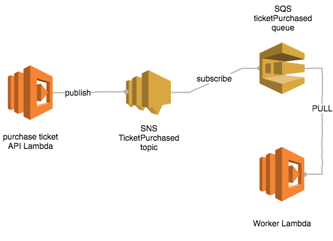
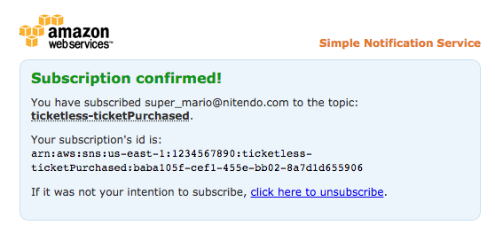

# Ticketless — getting started with Serverless and Lambda functions

| Previous lesson  | Next lesson      |
| :--------------- | ---------------: |
| [◀︎ 06 — Purchase ticket API](../06-purchase-ticket-api)| [08 — Worker Lambda ▶︎](../08-worker-lambda) |


## Lesson 07 — SNS and SQS


### Goal

In this lesson we will learn how to use SNS to fire a generic event (a ticket was purchased) and how to register an SQS queue to listen for those events and store them for later processing.


### Contents

- [Understanding SNS and SQS](#0701---understanding-sns-and-sqs)
- [Creating an SNS topic](#0702---creating-an-sns-topic)
- [Publishing a message from a Lambda](#0703---publishing-a-message-from-a-lambda)
- [Connect SQS to SNS](#0704---connect-sqs-to-sns)


## 07.01 - Understanding SNS and SQS

### SNS

SNS stands for Simple Notification Service and it's a service created by AWS to allow developers to easily fire notifications or dispatch messages across different system.

In [AWS's own words](https://aws.amazon.com/sns/):

> SNS is a pub/sub messaging service that makes it easy to decouple and scale microservices, distributed systems, and serverless applications


In SNS messages are transmitted through communication channel identified as *topics*. When you create a topic, different services can *publish* or *subscribe* (receive) events over it.

In our project we will use SNS to just dispatch a `TicketPurchased` event, leaving to other systems the role of picking the message up and performing other actions with it.

You can easily fire messages using SNS with the AWS SDK library, here's an example:

```javascript
const AWS = require('aws-sdk')
const sns = new AWS.SNS()

sns.publish({
  TopicArn: 'the arn of the SNS topic',
  Message: JSON.stringify({some: "arbitrary data"})
}, (err, data) => {
  if (err) {
    console.log('Ooops, it did not work', err)
  } else {
    console.log('Message published!')
  }
})
```

### SQS

SQS (Simple Queue System) is a fully managed message queuing service that makes it easy to decouple and scale microservices, distributed systems, and serverless applications.

You can use it to queue units of work can be performed asynchronously by one or more workers. Workers will periodically interrogate (*pull from*) the queue to see if there's work to do and report to the queue once some task is completed, so that no other work will try to perform it again.

In our application we will subscribe the queue to the `TicketPurchased` SNS topic, so that every SNS notification gets stored in the Queue, then (in the next lesson) we will create a worker lambda that can process it.



In this lesson we will focus on publishing a message through SNS and making sure that it gets delivered in the queue. In the next lesson we will create the worker and we will see how to pull from a queue and mark a message as consumed (*deleting* it from the queue) by using the AWS SDK.


## 07.02 - Creating an SNS topic

The first thing we have to do is to create an SNS topic.

So let's update our `template.yaml` with this new resource:

```yaml
TicketPurchasedTopic:
  Type: "AWS::SNS::Topic"
  Properties:
    TopicName: "ticketless-ticketPurchased"
```

Here we are simply defining a resource of type `AWS::SNS::Topic` and giving the topic the
name `ticketless-ticketPurchased`.

We want to be able from our ticket purchase API to publish a message on this topic,
so we also need to expand our permissions in the `GigsApiRole`.

Specifically we need to allow the action `sns:Publish` on the newly created resource.

To do this we have to append the following statement in our existing policy under
the `GigsApiRole`.

```yaml
- Effect: Allow
  Action:
  - sns:Publish
  Resource:
    Ref: TicketPurchasedTopic
```

In order to publish a message using the AWS SDK, our lambda needs to know the ARN
of the topic. This value is generated by AWS and an easy way to propagate this information
to the lambda is to use **environment variables**.

In SAM we can define environment variables in a Lambda with the property `Environment`
and inside it `Variables`.

Therefore, to propagate the SNS topic ARN, we have to update our `purchaseTicket` Lambda definition with
the following attributes:

```yaml
Environment:
  Variables:
    SNS_TOPIC_ARN: !Ref TicketPurchasedTopic
```

Then in our lambda code we will be able to access the current value of the topic ARN with

```javascript
const topicARN = process.env.SNS_TOPIC_ARN
```

At this point you can deploy the new stack with the usual commands:

```bash
sam package --template-file template.yaml --s3-bucket $DEPLOYMENT_BUCKET --output-template-file packaged.yaml
sam deploy --template-file packaged.yaml --stack-name $STACK_NAME --capabilities CAPABILITY_IAM
```

If everything went fine you should be now able to list all the available SNS topics from
the AWS cli and see our newly created topic:

```bash
aws sns list-topics
```

It should output something like this:

```json
{
  "Topics": [
    {
      "TopicArn": "arn:aws:sns:eu-west-1:123456789012:ticketless-ticketPurchased"
    }
  ]
}
```

**Note**: of course, you might have more SNS topics in your account, but you
should definitely have the `ticketless-ticketPurchased` topic among them)


## 07.03 - Publishing a message from a Lambda

At this point we are ready to update our `purchaseTicket` lambda in order to publish
an SNS message containing the data for the current ticket and the data of the referenced
gig.

Ideally our SNS message content should be an object containing two keys: `ticket` and `gig`:

  - `ticket` is an object that should contain the following fields:
    - `id`: a unique (and super-secret™) identification string used to verify the ticket validity
    - `createdAt`: the timestamp of ticket creation
    - `name`: the name of the owner of the ticket
    - `email`: the email of the owner of the ticket
    - `gig`: the slug of the gig associated to the ticket

  - `gig`: is the full object (as stored in DynamoDB) that represent the associated gig

This is all the information we might need to use in our worker lambda and it's a good
practice to propagate it directly in the SNS message.

> 💡 **TIP**: you can easily generate a unique ID with the module [`uuid`](http://npm.im/uuid)

> 💡 **TIP**: to generate the current timestamp you can simply use `Date.now()`

Try now to update the `purchaseTicket` lambda to publish the expected SNS message
just before returning the success response to API Gateway.

To do this you can use the following template as a guide or check out my solution
at [`resources/lambda/sns-sqs`](/resources/lambda/sns-sqs/src/index.js):

```javascript
//...
const sns = new AWS.SNS()
//...

exports.purchaseTicket = (event, context, callback) => {
  // ... (previous validation logic)

  // ... before sending the success response
  // 1. fetch the current gig from DynamoDB
  // 2. create the ticket object
  // 3. create the SNS message
  // 4. use the SDK to send the SNS message
  // 5. if the message publishing fails respond with a 500
  // 6. if it succeeds return the success message
}
```

When you feel that your code is ready you can deploy this new version of our app
as usual:

```bash
sam package --template-file template.yaml --s3-bucket $DEPLOYMENT_BUCKET --output-template-file packaged.yaml
sam deploy --template-file packaged.yaml --stack-name $STACK_NAME --capabilities CAPABILITY_IAM
```

If we try now to purchase a new ticket nothing visible really happens so that we can sure
the feature is working as expected.

Even if we implemented the SNS publishing correctly there's no topic *subscription* that is waiting
for messages in our current setup, so when a message is published it simply gets discarded.

An easy way to test this step is to create an email subscription so that we can receive
an email every time a new message is published in the `ticketPurchased` topic.

You can create an email subscription with the following command:

```bash
aws sns subscribe \
  --topic-arn <your topic ARN> \
  --protocol email \
  --notification-endpoint <your email>
```

Be sure to replace `<your topic ARN>` with your one (that you can retrieve with `aws sns list-topics`)
and `<your email>` with an actual email you own.

If the command worked correctly you should see the following output:

```json
{
  "SubscriptionArn": "pending confirmation"
}
```

To confirm the subscription, log in in your email account and check the last email from **AWS Notifications**.
There should be there a link to click. Once you do that you should see a page like this:



After that you should be able to list all the currently available subscriptions with the following command:

```bash
aws sns list-subscriptions-by-topic --topic-arn <your topic ARN>
```

Now try again to purchase a ticket from the frontend application. This time, after few
seconds, you should receive a message in your inbox!

> 💡 **TIP**: if you want to delete the subscription you can do it so with the [`unsubscribe`](http://docs.aws.amazon.com/cli/latest/reference/sns/unsubscribe.html) command, or, if you still have the AWS subscription confirmation page open, you'll find an 'unsubscribe' link there.


## 07.04 - Connect SQS to SNS

Now we have everything in place to fire SNS messages in our new topic.

The next logical step is to create a queue and subscribe it to the SNS topic.

We can achieve this by updating our `template.yaml`.

The first change is to define the new queue as resource:

```yaml
TicketPurchasedQueue:
  Type: "AWS::SQS::Queue"
  Properties:
    QueueName: "ticketless-ticketPurchased"
```

Then we have to update the `TicketPurchasedTopic` to add a subscription for our new queue:

```yaml
TicketPurchasedTopic:
  Type: "AWS::SNS::Topic"
  Properties:
    TopicName: "ticketless-ticketPurchased"
    Subscription:
      - Endpoint: !GetAtt TicketPurchasedQueue.Arn
        Protocol: "sqs"
```

As you might have learned already, anything that happens in AWS needs an explicit permission
in the form of a policy. The same goes for queues!

In order to receive a message from some resource a queue need to have a policy that explicitly authorizes that.

So, let's create this `QueuePolicy` in the resource block of our `template.yaml`:

```yaml
QueuePolicy:
  Type: AWS::SQS::QueuePolicy
  Properties:
    Queues:
      - Ref: TicketPurchasedQueue
    PolicyDocument:
      Version: "2012-10-17"
      Id: "ReceiveFromSnsPolicy"
      Statement:
        - Sid: "ReceiveFromSns"
          Effect: "Allow"
          Principal: "*"
          Action:
            - sqs:SendMessage
          Resource: "*"
          Condition:
            ArnEquals:
              "aws:SourceArn": !Ref TicketPurchasedTopic
```

That's finally it! Ready to re-deploy:

```bash
sam package --template-file template.yaml --s3-bucket $DEPLOYMENT_BUCKET --output-template-file packaged.yaml
sam deploy --template-file packaged.yaml --stack-name $STACK_NAME --capabilities CAPABILITY_IAM
```

If everything went fine you should now be able to see the new queue with the following command:

```bash
aws sqs list-queues
```

Which should output something like this:

```json
{
  "QueueUrls": [
    "https://eu-west-1.queue.amazonaws.com/123456789012/ticketless-ticketPurchased"
  ]
}
```

You can also check if the subscription was created correctly with:

```bash
aws sns list-subscriptions-by-topic --topic-arn <your topic ARN>
```


## Verify

If everything went all right, you can now go back to the frontend and purchase a new ticket!

Of course there's a command to check if messages are accumulating in the queue.

Given that you already know the queue URL from the last step:

```bash
aws sqs get-queue-attributes \
  --queue-url <your queue URL> \
  --attribute-names "ApproximateNumberOfMessages"
```

This should output something like:

```json
{
  "Attributes": {
    "ApproximateNumberOfMessages": "0"
  }
}
```

The number of messages should increase if you keep purchasing new tickets!


---

| Previous lesson  | Next lesson      |
| :--------------- | ---------------: |
| [◀︎ 06 — Purchase ticket API](../06-purchase-ticket-api)| [08 — Worker Lambda ▶︎](../08-worker-lambda) |
