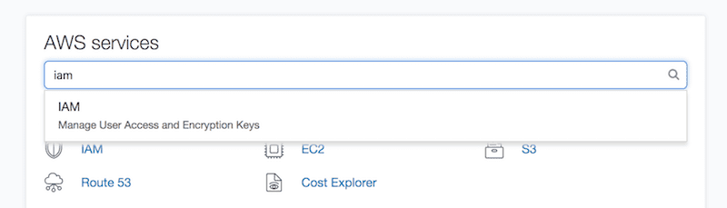
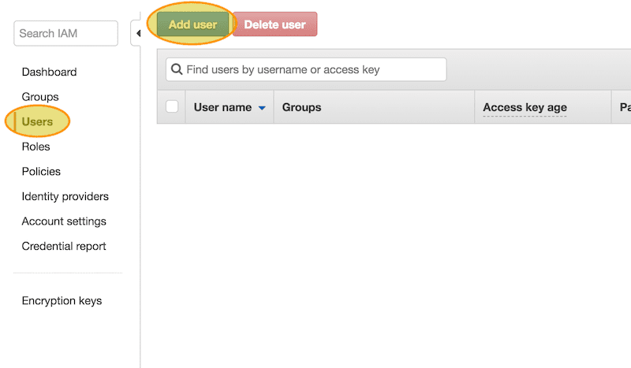
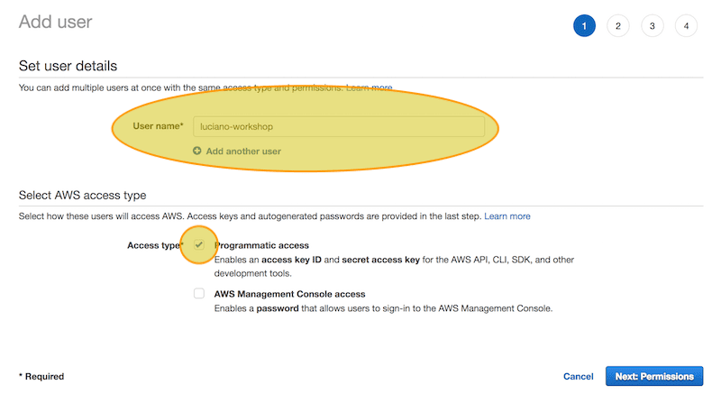
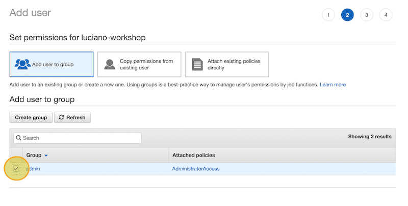
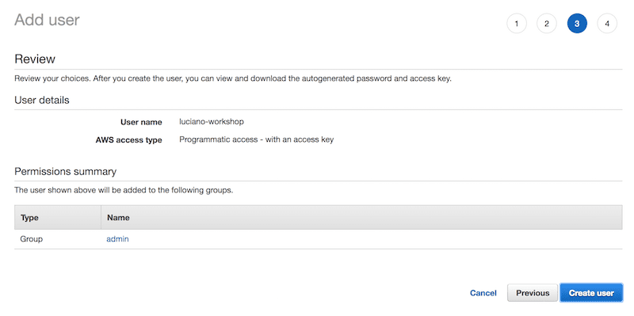
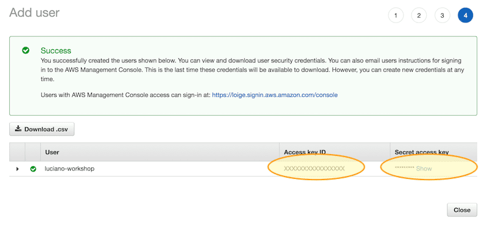

# How to create an AWS user

This document shows you how to create a new AWS User with admin permissions and
get the associated **Access Key ID** and **Secret Access Key**.

## 1. Enter IAM

To create a new user on your AWS account you have to use the IAM (Identity
  Access Management) service:

## 2. Select "Users / New User"

From IAM, select "Users" on the left and then "Add User" on top

## 3. Username and access type

At this point you can enter the chosen username and select the access type.

For the sake of this workshop it's necessary to have only the **programmatic access**.

You can keep using your own main user if you want to access the web console.

## 4. Admin permissions

Give the user admin permissions by selecting the **Admin** group or an equivalent
group (with **AdministratorAccess** policy).

## 5. Review

In this section you can easily review all the options before proceeding.

## 6. Access Key ID and Secret Access Key

Finally your user is created and here you can get your **Access Key ID** and **Secret Access Key**.

Store them in a safe place as you won't be able to visualize this a second time.

## That's all!

Have fun 🤓 and **remember to delete this user at the end of the workshop** if you
want to keep your AWS account clean and safe.
